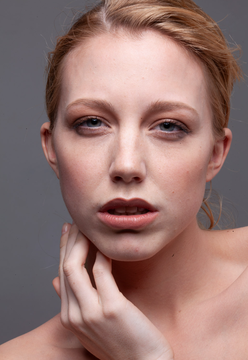
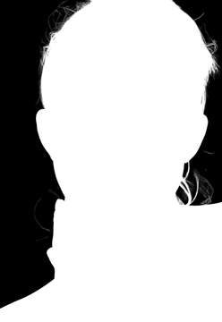
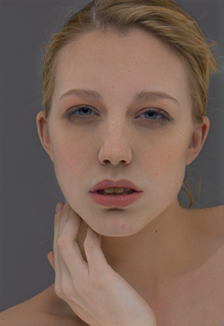
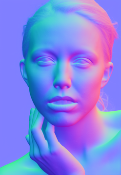
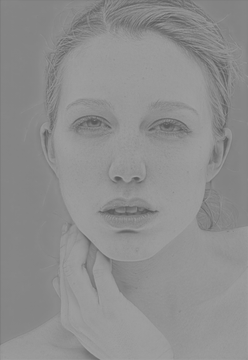
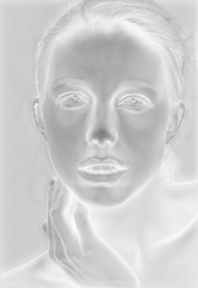
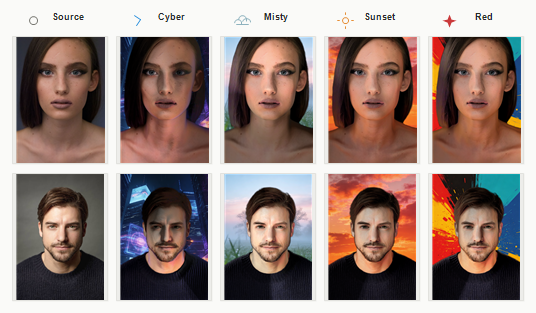

# Background Driven Portrait Relight

A Python portrait relighting pipeline for rendered portrait pass sets. It reads a
portrait source image plus render passes, analyzes a background image, and
transfers the background's lighting impression onto the subject.

The supported route is the `look-safe` pipeline. It keeps face and body exposure
stable while letting the background drive light direction, ambient color, rim
light, contrast and display finish.

## Key Features

- Background-driven portrait relighting from image analysis, not filename style rules.
- Single maintained `look-safe` route for stable face/body exposure.
- Subject-aware lighting across face, body, hair, clothes, rim and shadow regions.
- Built-in background presets: `cyber`, `misty`, `sunset`, `red`, `ice`, `exam`.
- Optional CUDA acceleration for selected large blur operations.
- Debug images and quality reports available from the CLI.

## Preview

Input pass examples from `singel_test/`:

| Source | Alpha | BaseColor |
| --- | --- | --- |
|  |  |  |

| Normal | Specular | Roughness |
| --- | --- | --- |
|  |  |  |

Background lighting looks:



## Project Structure

```text
render/
|-- main.py                 # Python entry
|-- run_test.sh             # CLI wrapper
|-- vfx_filter.py           # optional pass organizer before relighting
|-- vfx_filter.sh
|-- requirements*.txt
|-- config/
|   |-- constants.py
|   |-- paths.py
|   `-- background/         # bundled/selectable backgrounds
|-- interface/
|   `-- cli.py              # argument parsing and route setup
|-- lighting/
|   |-- background_analyzer.py
|   |-- light_scene.py
|   `-- models.py           # descriptors and policy data
|-- rendering/
|   |-- pipeline.py
|   |-- setup/              # input passes, masks, gradients
|   |-- look/               # look-safe allocation and atmosphere
|   |-- face/               # face/body region balancing
|   |-- light/              # key/fill/rim light behavior
|   |-- environment/        # background gradient, HDRI, PBR-like terms
|   |-- display/            # shadows and final display finish
|   |-- passes/             # main render pass
|   `-- finalize/           # composite, debug, quality, batch
|-- tools/
|   |-- color.py
|   |-- filters.py
|   `-- image_io.py
|-- docs/showcase/          # README preview images
`-- singel_test/            # sample input pass folder
```

Main route:

```text
main.py
-> interface/cli.py
-> lighting/background_analyzer.py
-> lighting/light_scene.py
-> rendering/pipeline.py
-> rendering/passes/render_pass.py
-> rendering/finalize/batch.py
```

## Installation

```bash
pip install -r requirements.txt
```

Optional CUDA dependency:

```bash
pip install -r requirements-gpu.txt
```

## Input Folder

The input folder is a render-pass directory:

```text
Source/
Alpha/
Normal/
Depth/
BaseColor/    # or EightColor/ or Color/
Specular/     # optional
Roughness/    # optional
Camera.json   # optional
```

The included sample input is:

```text
E:/render/singel_test
```

## Before Relighting: vfx_filter

`vfx_filter` is the optional pre-lighting preparation step. Use it before the
relighting command when your exported VFX/render passes are still raw, mixed, or
not arranged in the folder layout required by this project.

Its purpose is to prepare a clean relight input folder:

```text
raw exported passes
-> vfx_filter
-> Source / Alpha / Normal / Depth / BaseColor / Specular / Roughness
-> background-driven relighting
```

Typical use:

```bash
sh E:/render/vfx_filter.sh
```

After it finishes, point `--input-dir` at the generated pass folder and run the
relight command. If your input is already organized like `singel_test`, skip this
step and run relighting directly.

## Quick Start

```bash
sh run_test.sh --input-dir E:/render/singel_test --back cyber
```

## Background Images

Put background images here:

```text
config/background/
```

Select a background by filename stem:

```text
config/background/cyber.png  ->  --back cyber
config/background/red.png    ->  --back red
```

## Outputs

Without `--output-dir`, outputs are created under the input folder:

```text
singel_test/output_cyber_looksafe/
```

Common output folders:

```text
Render/          final composited images
Relit/           relit foreground
Cutout/          transparent foreground cutout
HDRI/            lighting preview
LightingInfo/    extracted background lighting data
QualityReport/   per-image quality report
Debug/           intermediate images when --debug is used
```

## Configuration

| Flag | Description |
| --- | --- |
| `--input-dir` / `--base-path` | Input pass root |
| `--back` | Background name or direct image path |
| `--background-dir` | Folder used to resolve background names |
| `--output-dir` | Exact output root |
| `--device cpu|cuda|auto` | Execution backend |
| `--gpu` | Shortcut for `--device cuda` |
| `--debug` | Save intermediate debug images |
| `--no-quality-report` | Disable quality report JSON output |

## Development Rules

- Keep one user-facing route: `main.py` -> `interface/cli.py`.
- Keep style expression driven by background analysis, not filename-specific branches.
- Put background analysis changes in `lighting/`.
- Put subject relighting changes in the matching `rendering/` subsystem.
- Put low-level reusable helpers in `tools/`.
- Avoid reintroducing legacy route switches or broad compatibility wrappers.
